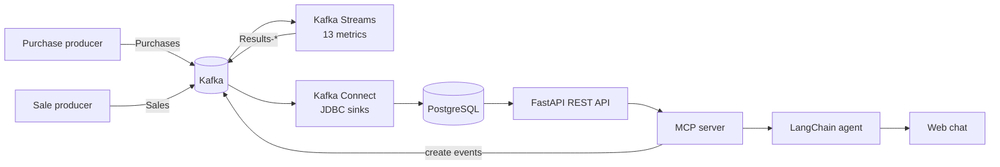

# Kafka Bookstore Analytics

Real-time analytics pipeline for a bookstore built on Apache Kafka. Purchase and sale events are processed by Kafka Streams into 13 business metrics (revenue, expenses, profit, averages, top book, last-hour windows, sales by country), stored in PostgreSQL through Kafka Connect, and exposed through a REST API and an AI agent (LangChain + MCP) that can both query the metrics and produce new events.

University project for the *Integração de Sistemas* (Systems Integration) course, Computer Engineering (LEI), University of Coimbra.

## Features

- Kafka Streams topology computing 13 metrics over `Purchases` and `Sales` events, including time-windowed aggregations
- Kafka Connect: a JDBC source (reference data) and JDBC sinks writing each `Results-*` topic to PostgreSQL
- Event producers generating random purchases and sales
- REST API (FastAPI) with CRUD and analytics endpoints
- MCP server exposing tools to read analytics and to create purchase and sale events
- LangChain agent (Google Gemini) with a simple web chat

## Architecture



| Part | Path | Description |
|---|---|---|
| Kafka side (Java) | `kafka/` | Kafka Streams app, event producers, Kafka Connect connector configs, SQL schema and the Docker setup |
| API side (Python) | `api/` | REST API, MCP server, LangChain agent and web chat |
| Documentation | `docs/` | Detailed run guide (in Portuguese) |

### Services and ports

| Service | Port |
|---|---|
| REST API | 8001 |
| MCP server | 8002 |
| Agent API | 8000 |
| PostgreSQL | 5433 |
| Kafka broker (host / internal) | 29092 / 9092 |
| Kafka Connect | 8083 |

### Metrics

| Metric | Output topic |
|---|---|
| Revenue, expenses and profit per book | `Results-revenue-per-book`, `Results-expenses-per-book`, `Results-profit-per-book` |
| Total revenue, expenses and profit | `Results-total-revenue`, `Results-total-expenses`, `Results-total-profit` |
| Average purchase per book / overall | `Results-avg-purchase-per-book`, `Results-avg-purchase-all` |
| Book with the highest profit | `Results-top-profit-book` |
| Revenue, expenses and profit in the last hour | `Results-revenue-last-hour`, `Results-expenses-last-hour`, `Results-profit-last-hour` |
| Top country sales per book | `Results-top-country-sales-per-book` |

## Tech Stack

Apache Kafka (Streams, Connect) · Java · Maven · PostgreSQL · Docker Compose · Python · FastAPI · SQLModel · MCP (FastMCP) · LangChain / LangGraph · Google Gemini

## Getting Started

### Prerequisites

- Docker and Docker Compose
- Python 3.10+
- A Google AI (Gemini) API key for the agent

### Installation and usage

**1. Kafka side** (everything runs inside Docker):

```bash
cd kafka
docker compose -f .devcontainer/docker-compose-standalone.yml up -d
docker compose -f .devcontainer/docker-compose-standalone.yml exec command-line bash
```

Inside the container:

```bash
cd /workspace && mvn clean package -DskipTests
kafka-topics.sh --create --bootstrap-server broker1:9092 --topic Purchases --partitions 1 --replication-factor 1
kafka-topics.sh --create --bootstrap-server broker1:9092 --topic Sales --partitions 1 --replication-factor 1
cd config && ./post_connectors.sh
cd .. && ./run_streams.sh
```

**2. API side:**

```bash
cd api
python -m venv .venv && source .venv/bin/activate   # on Windows: .venv\Scripts\activate
pip install -r requirements.txt
cp .env.example .env                                  # then put your own GOOGLE_API_KEY in .env
python main.py             # REST API    -> http://127.0.0.1:8001
python mcp_server.py       # MCP server  -> http://127.0.0.1:8002/sse
python langchain_agent.py  # Agent API   -> http://127.0.0.1:8000
```

Open `api/webapp.html` in a browser to chat with the agent. On Windows, `scripts\start_all.bat` starts the three Python services.

See [`docs/README.md`](docs/README.md) for the full guide (in Portuguese), including how to verify topics and database tables.

## Usage example

Through the chat you can ask for metrics or generate events, for example:

- *"Sell 5 copies of book 3 to Portugal for 20 euros"*
- *"Generate 10 random test transactions"*
- *"What is the total profit?"*

## Authors

Simão Carvalho, André Rodrigues · University of Coimbra · Computer Engineering · 2026
